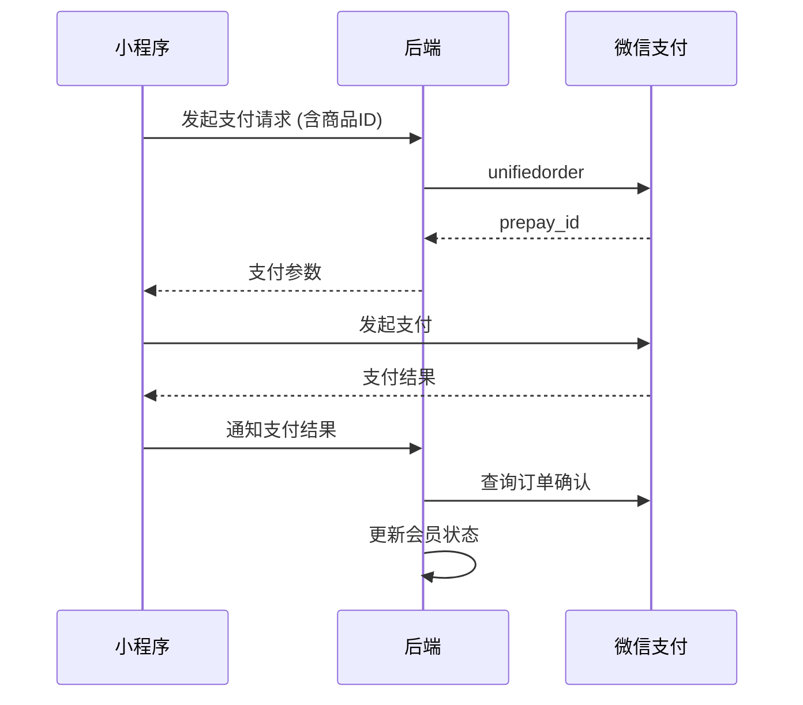

# WeChat Mini-Program Security Guide — 易理明灯

> 适用版本：微信小程序
> 最后更新：2026-07-21

---

## 1. Overview / 概述

本指南涵盖易理明灯微信小程序的安全最佳实践。由于小程序运行在微信生态内，需同时遵守微信平台的合规要求和中国《个人信息保护法》（PIPL）的相关规定。

---

## 2. WeChat Authentication / 微信认证

### 2.1 openid vs unionid

| 标识 | 范围 | 用途 | 安全要求 |
|------|------|------|----------|
| `openid` | 单小程序唯一 | 用户身份标识，作为JWT sub | 不可暴露到客户端外部 |
| `unionid` | 同主体多小程序/公众号唯一 | 跨平台用户关联 | 仅在服务端使用，需在微信开放平台绑定 |
| `session_key` | 单次登录有效 | 解密敏感数据 | 永不传输给客户端，不在服务器存储 |

### 2.2 登录流程

```
[小程序] --wx.login()--> [微信服务器] --> code
[小程序] --code--> [后端 /api/auth/wechat-login]
[后端]   --code + appid + secret--> [微信服务器] --> openid + session_key
[后端]   --create JWT--> [小程序] (7天有效期)
```

**安全要点：**
- `session_key` 绝不返回给小程序端
- `code` 一次性使用，有效期5分钟
- JWT 存储在 `wx.setStorageSync`（加密存储），不可放入 URL 参数
- 登录接口必须限流：5次/分钟/IP

### 2.3 Token 管理

```python
# JWT payload structure
{
    "sub": "openid_xxxxx",    # WeChat openid
    "openid": "xxxxx",        # For server-side checks
    "role": "user",           # user / admin
    "iat": 1700000000,        # Issued at
    "exp": 1700604800,        # 7 days from iat
    "jti": "random_hex"      # Token ID for revocation
}
```

- 有效期：7天
- 刷新策略：有效期过半可刷新
- 撤销列表（可选）：Redis set 存储已撤销 jti

---

## 3. Sensitive Data Handling / 敏感数据处理

### 3.1 数据分类

| 等级 | 数据类别 | 示例 | 保护要求 |
|------|----------|------|----------|
| L1 | 个人身份 | 出生日期、出生时间、出生地点 | 传输加密 + 存储加密 |
| L2 | 命理数据 | 八字、紫微斗数排盘 | 存储加密 |
| L3 | 交互数据 | 咨询问题、聊天记录 | 传输加密 |
| L4 | 匿名数据 | 使用统计、功能偏好 | 标准保护 |

### 3.2 加密要求

- **传输层**：全站 HTTPS （TLS 1.2+）
- **存储层**：出生日期/时间使用 AES-256-GCM 加密
- **用户ID**：日志中存储 HMAC 哈希后的 ID

### 3.3 客户端注意事项

```javascript
// ❌ 不安全：将敏感数据存入缓存
wx.setStorageSync('user_bazi', baziData);

// ✅ 安全：仅缓存必要的非敏感数据
wx.setStorageSync('has_bazi', true);
wx.setStorageSync('user_preferences', {
  personality: 'sassy',
  theme: 'dark'
});

// 敏感数据请求时实时从服务器获取
const res = await wx.request({
  url: 'https://api.example.com/api/user/profile',
  header: { Authorization: `Bearer ${token}` }
});
```

---

## 4. API Security / 接口安全

### 4.1 请求签名

所有服务端接口验证 JWT token：

```
Authorization: Bearer <jwt_token>
```

### 4.2 防重放

- 关键操作（支付、删除数据）需携带 `timestamp + nonce` 参数
- 服务端校验 timestamp 在 5 分钟内
- nonce 5 分钟内不可重复使用

### 4.3 敏感操作确认

删除数据或导出数据前，需二次确认：

```javascript
wx.showModal({
  title: '确认操作',
  content: '确定要删除所有数据吗？此操作不可恢复！',
  success: (res) => {
    if (res.confirm) {
      // 执行删除
    }
  }
});
```

---

## 5. Payment Security / 支付安全

### 5.1 微信支付



### 5.2 安全要点

- **金额由服务器生成**：客户端不可信任金额参数
- **支付回调验证**：必须验证微信支付回调签名
- **幂等性**：同一订单号不可重复处理
- **日志记录**：所有支付操作记录审计日志
- **退款**：退款必须管理员审核

### 5.3 防止刷单

- 同一用户每天最多 5 次支付尝试
- 支付 IP 与登录 IP 异常时触发风控
- 短时间内多次失败支付需验证码

---

## 6. Mini-Program Security Checklist

### 6.1 开发阶段

- [ ] 不在代码中硬编码任何密钥、token
- [ ] 使用 `wx.request` 的 HTTPS 请求
- [ ] 不在本地存储 session_key
- [ ] 所有用户输入在客户端做基本校验（长度、格式）
- [ ] 关键操作（支付、删除）有二次确认弹窗
- [ ] 禁止使用 `eval` 和相关动态执行函数
- [ ] 禁止使用 `innerHTML` 或 `setHTML`
- [ ] 使用微信提供的 `<rich-text>` 替代 HTML 渲染

### 6.2 上线前

- [ ] 配置小程序服务器域名白名单（只允许 HTTPS）
- [ ] 配置 Webview 业务域名（如有 H5 页面）
- [ ] 关闭开发者工具中的「不校验合法域名」选项
- [ ] 审核时确认不包含任何敏感词
- [ ] 用户协议与隐私政策已完成备案
- [ ] 添加《娱乐声明》与《个人信息保护声明》

### 6.3 运营阶段

- [ ] 监控接口异常调用频率
- [ ] 定期轮换 JWT 密钥（建议每月）
- [ ] 审核用户反馈中的安全问题
- [ ] 关注微信小程序安全公告
- [ ] 每季度安全审计

---

## 7. Privacy Compliance / 隐私合规

### 7.1 小程序隐私接口声明

根据微信要求，使用以下接口需在 `app.json` 中声明：

```json
{
  "requiredPrivateInfos": [
    "getLocation",
    "chooseAddress"
  ]
}
```

目前易理明灯小程序仅在用户授权的情况下才访问：
- 用户昵称与头像（用于个性化展示）
- 手机号（用于会员登录，可选）

### 7.2 PIPL 合规

- **收集告知**：在用户首次打开时弹窗说明数据用途
- **最小必要**：仅收集必要的出生年月日时分
- **存储期限**：用户超过 180 天未活跃将自动删除数据
- **删除权**：用户在「设置」中可一键删除所有数据
- **导出权**：用户在「设置」中可导出数据
- **未成年人保护**：未满 14 周岁用户需监护人同意

### 7.3 隐私政策链接

隐私政策应在小程序启动时展示，链接指向：
```
https://api.example.com/privacy
```

---

## 8. Incident Response / 安全事件响应

### 8.1 小程序特定事件

| 事件类型 | 响应措施 | 时限 |
|----------|----------|------|
| SDK 安全漏洞 | 更新微信开发者工具和基础库 | 24h |
| 用户数据泄露 | 立即下线受影响功能，通知用户 | 2h |
| 小程序被封禁 | 检查违规原因，提交申诉 | 1h |
| 支付异常 | 暂停支付功能，排查原因 | 15min |

### 8.2 联系我们

安全相关问题请联系：
- 邮箱：security@fortune-agent.com
- 响应时间：工作日 2 小时内

---

## 9. References / 参考资料

- [微信小程序开发文档 - 安全](https://developers.weixin.qq.com/miniprogram/dev/framework/security.html)
- [微信小程序隐私政策指南](https://developers.weixin.qq.com/miniprogram/dev/framework/ability/privacy.html)
- [个人信息保护法（PIPL）全文](http://www.npc.gov.cn/npc/c30834/202108/a8c4e3672c74491a80b53a172bb753fe.shtml)
- [GB/T 35273-2020 信息安全技术 个人信息安全规范](http://std.samr.gov.cn/gb/search/gbDetailed?id=7B3B9D3B5F4B3E3AE05397BE0A0AB82A)
